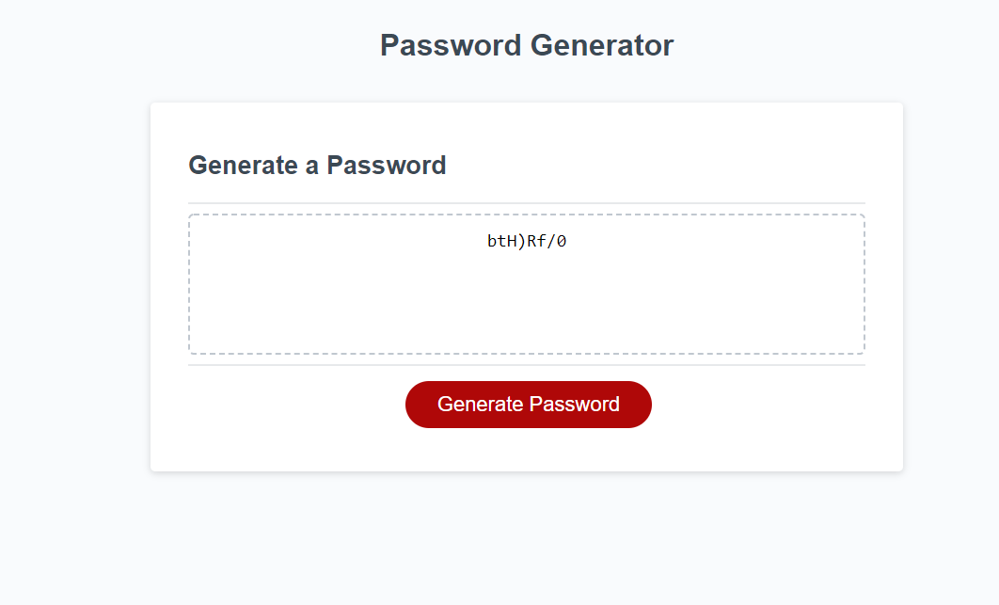

# Randon-Number-Gen

This is an application to generate a password between 8-128 characters. It will provide the option to add in lower case letters, upper case letters, special characters, and numbers. At least one of these options must be selected to create a password.

If you do not select the apporiate number of characters or if you do not selec one of the arrays to add to the password, then you will be sent back to the corresponding prompt.

There is a counter for each array to make sure at least one characters from each option is added ot the password. If there is not at least one character is added from the array, it will dump that password and generate another.

Once the password is generated it will display that password in the prompt and add the password to the screen. You can generate multiple passwords and have them all displayed on the screen. Refreshing the page will remove them from the screen.

Credits:
My study group as always is helpful with walking through my project and assistaning on solving issues.
Chip Long, Alex Jurgs, Jared Sutch, Lacey Page, Lauren Gabaldon, and Tarik Maggio.

# Random-Num-Gen
